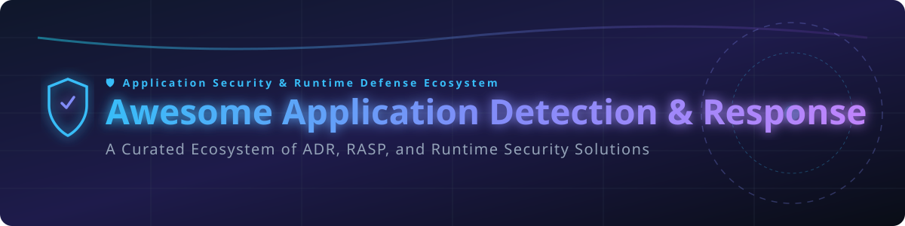

# 🛡️ Awesome Application Detection & Response (ADR)

  

---

### 📊 Top Application Detection & Response (ADR) Ecosystem

> **Curated List of SaaS Products & Open-Source GitHub Projects**  
> *Focused on Runtime Application Security, In-App Attack Detection & Blocking, RASP Evolution, Code-Level Threat Visibility & Application-Layer Detection and Response*  
>
> **Last updated:** September 2026

---

## 🔍 Overview & Market Intelligence

Application Detection & Response (ADR) embeds lightweight sensors inside running applications and APIs to observe code execution, data flow, and request handling in real-time—confirming exploits at the process level rather than relying on perimeter signals.

> 💡 **Market Size & Structure:**  
> The estimated global market size for Application Security & Runtime Protection (ADR/RASP/AppSec) is **~$6.5 Billion (2026)** and is projected to reach over **$12 Billion by 2030**.  
> The sector is **moderately fragmented**: major cloud security and observability giants (CrowdStrike, Datadog, Dynatrace, Google Cloud/Wiz) hold significant market share via platform consolidation, while specialized RASP/ADR innovators (Contrast Security, Apiiro, Ox Security) dominate deep code-level instrumentation.

---

## 📋 Table of Contents

- [🏢 SaaS & Hosted Platforms](#-saas--hosted-platforms)
- [🔓 Open-Source GitHub Projects](#-open-source-github-projects)
- [🤝 How to Contribute](#-how-to-contribute)
- [💖 Support & Community](#-support--community)
- [📈 Star History](#-star-history)
- [⚠️ Disclaimer](#%EF%B8%8F-disclaimer)

---

## 🏢 SaaS & Hosted Platforms

Below is a curated list of enterprise SaaS platforms offering Application Detection & Response (ADR), RASP, and Cloud Workload/AppSec protection.  
*Sorted by Company Size / Valuation (Descending).*

| Platform 🚀 | Description 📝 | Valuation / Revenue 💰 | Starting Pricing 💵 | Free Tier / Trial Limit 🎁 |
| :--- | :--- | :--- | :--- | :--- |
| **[CrowdStrike Falcon Cloud](https://www.sentinelone.com/)** 🦅 | Extended detection and response platform with cloud workload and application runtime protection modules. | **$85.2B Valuation** (~$3.9B Annual Revenue) | $59.99/device/yr (Falcon Go starting tier) | 15-day full-featured free trial |
| **[Datadog AppSec](https://www.datadoghq.com/)** 🐶 | Runtime application security integrated with Datadog’s observability platform for attack detection and APM context. | **$79.0B Valuation** (~$4.2B Annual Revenue) | $15.00/host/month (Infrastructure Pro tier) | Free tier up to 5 hosts (14-day full trial) |
| **[Dynatrace AppSec](https://www.dynatrace.com/)** 📊 | Runtime application security & vulnerability management built directly into Dynatrace observability. | **$16.8B Valuation** (~$1.6B Annual Revenue) | $0.08/host-hour (Full-Stack Monitoring tier) | 15-day free trial (Public Playground access) |
| **[Google Cloud / Wiz Runtime](https://www.aquasec.com/)** ☁️ | Cloud-native runtime protection and agentless workload security platform. | **$32.0B Valuation** (Acquired by Google; ~$1B ARR) | ~$2,000/month ($24,000/yr minimum commitment) | 30-day enterprise Proof-of-Concept (PoC) |
| **[SentinelOne Singularity Cloud](https://www.sentinelone.com/)** 🛡️ | Autonomous XDR platform featuring cloud workload and container application runtime defense. | **$8.1B Valuation** (~$800M Annual Revenue) | $45.00/endpoint/yr (Singularity Core tier) | 30-day evaluation trial (PoC via sales) |
| **[Aqua Security](https://www.aquasec.com/)** 🐳 | Full cloud-native application protection platform (CNAPP) with runtime security and container protection. | **$1.4B Valuation** (~$120M Annual Revenue) | $0.80/workload/day (Aqua Cloud Enterprise) | 30-day free trial (Developer Free Tier available) |
| **[Contrast Security (ADR / Protect)](https://www.contrastsecurity.com/)** 🎯 | Pioneer of Application Detection & Response (ADR) using runtime sensors for code-level exploit confirmation. | **$750/month** ($9,000/yr billed annually for 8 apps) | **$1.0B Valuation** (~$91.7M Annual Revenue) | **CVE Shield Free Tier** (Free forever for 2 production apps) |
| **[Apiiro](https://apiiro.com/)** 🔬 | Deep application risk management platform spanning code-to-runtime visibility and risk context. | **$600M Valuation** (~$40M Annual Revenue) | ~$1,500/month (Custom enterprise team tier) | 14-day trial / sales demo |
| **[Ox Security](https://apiiro.com/)** 🐂 | End-to-end pipeline and runtime application security visibility with attack-path analysis. | **$250M Valuation** (~$15M Annual Revenue) | ~$1,000/month (Enterprise team package) | 14-day free trial |
| **[New Relic Security](https://apiiro.com/)** 📈 | Vulnerability management and runtime application protection embedded in New Relic telemetry. | **$6.5B Valuation** (Private equity acquiree; ~$990M ARR) | $49/user/month (Core User tier; $0.30/GB ingest) | **Free Forever Tier** (100 GB/month data ingest free) |

---

## 🔓 Open-Source GitHub Projects

Curated open-source projects providing runtime application self-protection (RASP), eBPF-based kernel/container runtime security, Web Application Firewalls (WAF), and tracing instrumentation.  
*Sorted by GitHub Star Count (Descending).*

| Project 🌟 | Description 💡 | GitHub Stars Badge 🏷️ | Category 🗂️ |
| :--- | :--- | :--- | :--- |
| **[OWASP ModSecurity](https://github.com/owasp-modsecurity/ModSecurity)** 🛡️ | Open-source, cross-platform Web Application Firewall (WAF) engine providing HTTP traffic inspection and blocking. |  | WAF / Traffic Security |
| **[Falco](https://github.com/falcosecurity/falco)** 🦅 | CNCF cloud-native runtime security tool leveraging eBPF to detect anomalous system and application activity. |  | eBPF Runtime Security |
| **[Pixie](https://github.com/pixie-io/pixie)** 🧚 | CNCF no-instrumentation eBPF observability framework used for runtime security and performance tracing. |  | eBPF Observability |
| **[BTrace](https://github.com/btraceio/btrace)** 🔍 | Safe dynamic tracing tool for Java application runtimes to inspect execution flow without restarting processes. |  | Java Dynamic Tracing |
| **[Tetragon](https://github.com/cilium/tetragon)** 🟩 | eBPF-based security observability and runtime enforcement engine built by Cilium for Kubernetes and Linux. |  | eBPF Runtime Enforcement |
| **[Tracee](https://github.com/aquasecurity/tracee)** 🔎 | Aqua Security's eBPF-powered runtime security and forensics tool for Linux containers and workloads. |  | eBPF Threat Detection |
| **[Coraza WAF](https://github.com/corazawaf/coraza)** ⚡ | Enterprise-ready, high-performance open-source Golang Web Application Firewall compatible with OWASP CRS. |  | Go WAF Engine |
| **[Baidu OpenRASP](https://github.com/baidu/openrasp)** 🔓 | Open-source Runtime Application Self-Protection engine hooking into JVM & PHP runtimes to block in-app exploits. |  | In-App RASP Engine |
| **[KubeArmor](https://github.com/kubearmor/KubeArmor)** 🛡️ | CNCF cloud-native runtime security system enforcing LSM-based (AppArmor/SELinux/eBPF) access controls. |  | Cloud-Native Enforcer |

---

## 🤝 How to Contribute

Contributions are always welcome! 

1. 🍴 **Fork** the repository.
2. 📝 **Add/edit** entries in [`README.md`](file:///C:/Users/hp/Documents/Projects/Awesome-Application-Detection-n-Response/README.md) following the table structure.
3. 🔗 Include factual details: platform name, link, pricing/stars, and description.
4. 🚀 Submit a **Pull Request** with a clear explanation.

For guidelines on awesome lists, check out [Awesome-Awesome-Awesome](https://github.com/ishandutta2007/Awesome-Awesome-Awesome).

---

## 💖 Support & Community

Thank you for visiting and supporting this project! If you find this curated list helpful, please consider supporting the project by:

- 🌟 **Starring** the repository to make it more visible to the community.
- 🍴 **Forking** it to keep a copy or contribute updates.
- 📢 **Sharing** it with fellow AppSec engineers, SecOps professionals, and developers.

---

## 📈 Star History

---

## ⚠️ Disclaimer

- This repository is a **community-curated** list intended for educational and research purposes.
- Runtime security agents operate within production application processes. Ensure thorough testing in non-production environments before deploying sensors or enforcement rules.
- Market valuations, pricing estimates, and star counts are updated periodically as of September 2026.

---

Made with ❤️ for AppSec Engineers, SecOps Teams, Platform Security, and Developers.

